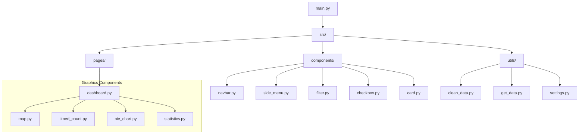
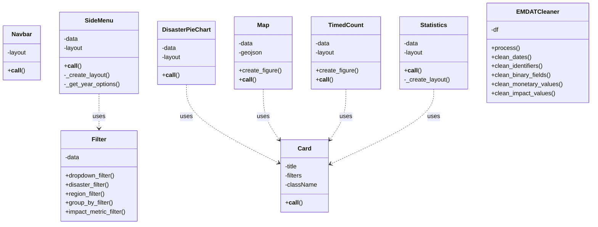

# Global Disasters Dashboard

An interactive dashboard for analyzing and visualizing global data on natural and technological disasters, based on the [EM-DAT](https://public.emdat.be/) database.

# User Guide

### Installation and Deployment

1. Clone the repository:
```bash
git clone https://github.com/Hyprra/disasters.git
cd disasters
```

2. Create and activate a virtual environment:
```bash
python -m venv .venv
```
_On Windows:_
```bash
.\.venv\Scripts\activate
```
_On Unix or MacOS:_
```bash
source .venv/bin/activate
```

3. Install dependencies:
```bash
pip install -r requirements.txt
```

4. Launch the dashboard:

_If you want to only launch the dashboard_
```bash
python main.py
```
_If you want to scrape before launching the dashboard_
_You'll have to create a config.py file in the project root with your [emdat](https://public.emdat.be/) credits_
_Data will be fetched from the website then cleaned_
```bash
python main.py --scrape
```
_If you want to clean the data before launching the dashboard_
_Data from raw data folder will be cleaned_
```bash
python main.py --clean
```

5. Open a web browser and navigate to:
```
http://127.0.0.1:8050/
```

## Data

This project uses EM-DAT data which includes:

- Global disaster events
- Type, location, and timing of events
- Impact metrics (deaths, affected people, economic damage)
- Geographic information for mapping

Data organization:
- `data/raw/`: Raw data
- `data/cleaned/`: Cleaned data
- `data/geo_mapping/`: Geographic data (Countries GeoJSON)

## Developer Guide

### Project Architecture (files)



### Project Architecture (classes)


### Adding New Components

To add a new component:
1. Create a file in `src/components/`
2. Follow the existing structure:
   - Use class-based components
   - Implement the `__call__` method
   - Use Tailwind CSS for styling
   - Add callbacks if needed

### Adding New Visualizations

To add a new visualization:
1. Create a file in `src/graphics/`
2. Implement your visualization component class and callbacks if you have
3. Register callbacks in `src/pages/dashboard.py`
4. Add the visualization to the dashboard layout

## Analysis Report

Key findings from the data visualization:

1. Temporal Trends:
   - Number of recorded disasters has decreased over time
   - This increase might be linked to improved reporting systems

2. Geographic Distribution:
   - Disasters are not evenly distributed globally, some countries are more affected like Indonesia, China and India due to their large population and geographic exposure
   - Some regions are more vulnerable to specific types of disasters, with Asia experiencing more floods and Europe facing more extreme temperatures

3. Impact:
   - Economic damages have increased over time, maybe because of the growing urbanization and higher value of infrastructures in affected areas
   - Deaths have gone down over the years, because of better early warning systems and improved disaster reactions

## Copyright

I hereby declare that all code in this project has been produced entirely by me/us.